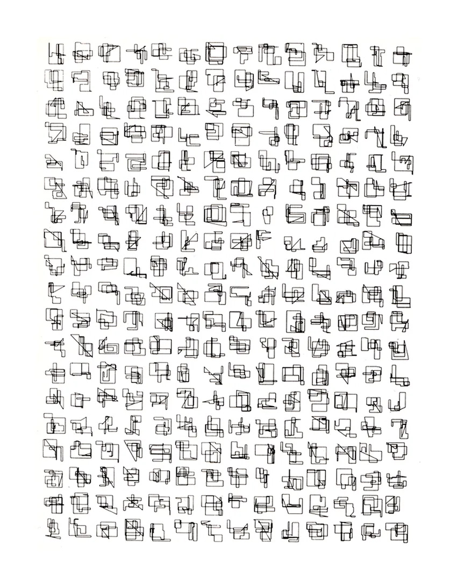
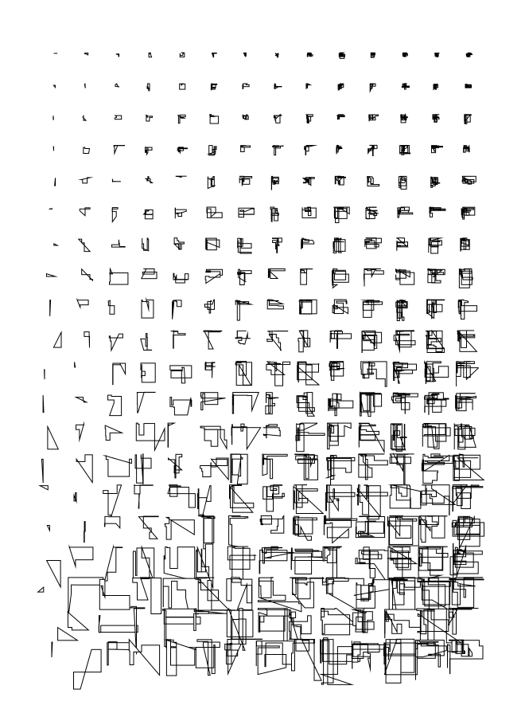

# Georg Nees: »Graphik aus Dreiundzwanzigzackigen«

this sketch can generate artworks similar to Georg Nees' »Graphik aus Dreiundzwanzigzackigen« (1964). it reacts to the movement of your mouse but what properties can you alter in the x/y dimension?

### [try it out in your browser](https://niezuhaus.de/p/algorithmic_drawing/georg_nees)

### original

### example output

