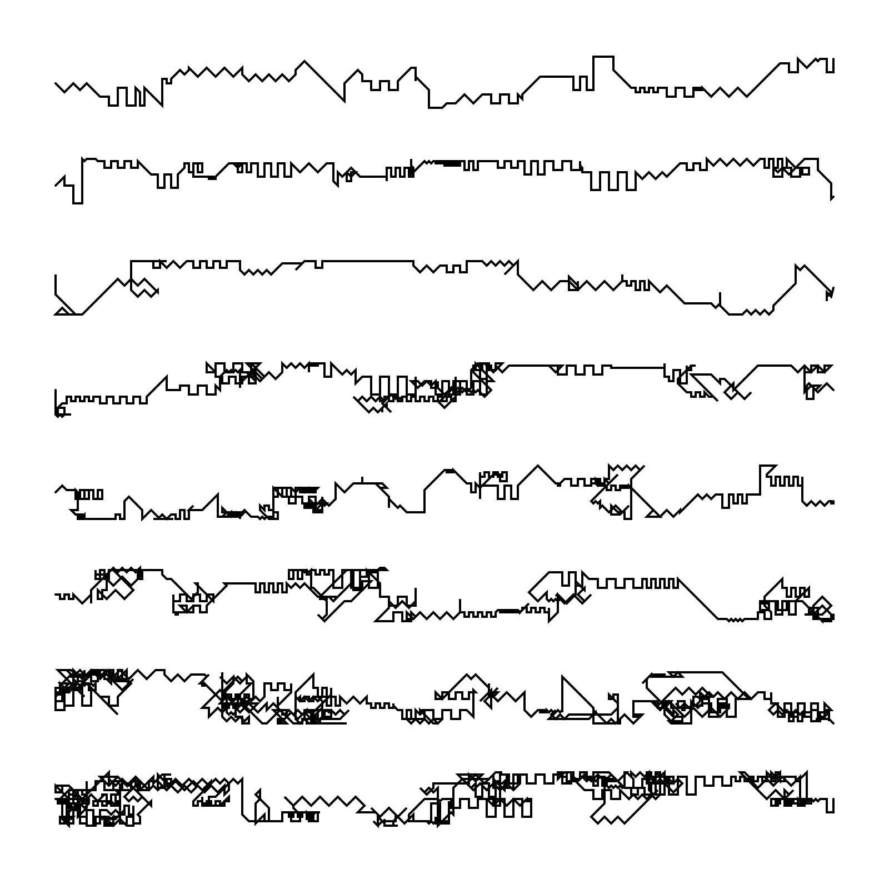

# Manfred Mohr: »P021-G«

this sketch can generate artworks similar to Manfred Mohrs »P021-G« (1970).

### [try it out in your browser](https://niezuhaus.de/p/algorithmic_drawing/manfred_mohr)

### original

### example output

